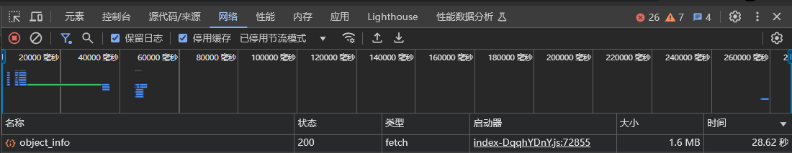
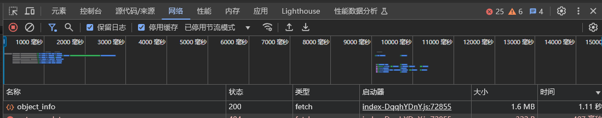

# ComfyUI 启动加速补丁

## 简介
这个补丁插件通过优化 ComfyUI 服务器的节点信息处理机制，显著提升了服务器的性能和响应速度。显著减少浏览器页面初始化等待时间。

## 主要特性
- 🚀 节点信息缓存机制
- 🔄 异步节点加载
- 📊 实时加载进度显示


## 工作原理
1. **节点信息缓存**：
   - 使用后台线程监控节点加载
   - 将节点信息存储在内存中
   - 减少重复计算开销

2. **异步加载**：
   - 通过后台线程异步处理节点信息
   - 不阻塞主服务器线程
   - 提供平滑的用户体验

3. **进度监控**：
   - 实时显示节点加载进度
   - 提供详细的加载时间统计
   - 方便调试和监控

## 效果对比

### 安装前

*未安装补丁时，页面初始化需要较长时间，节点加载速度慢*

### 安装后

*安装补丁后，页面初始化时间显著缩短，节点加载速度提升*

## 安装方法

1. 进入您的 ComfyUI 安装目录下的 `custom_nodes` 文件夹
2. 执行以下命令：
```
git clone https://github.com/LAOGOU-666/Comfyui_StartPatch.git
```

## 使用说明
插件会自动运行，无需额外配置。安装后，您将注意到：
- 浏览器页面初始化时间显著减少
- 节点信息加载速度更快
- 服务器响应时间缩短

